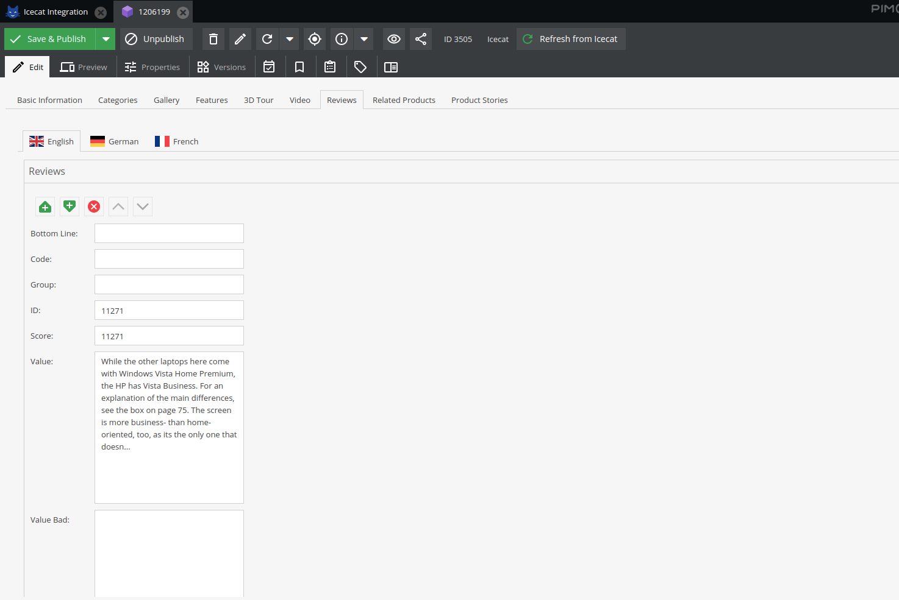
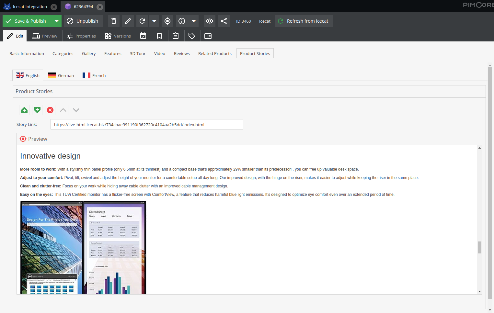
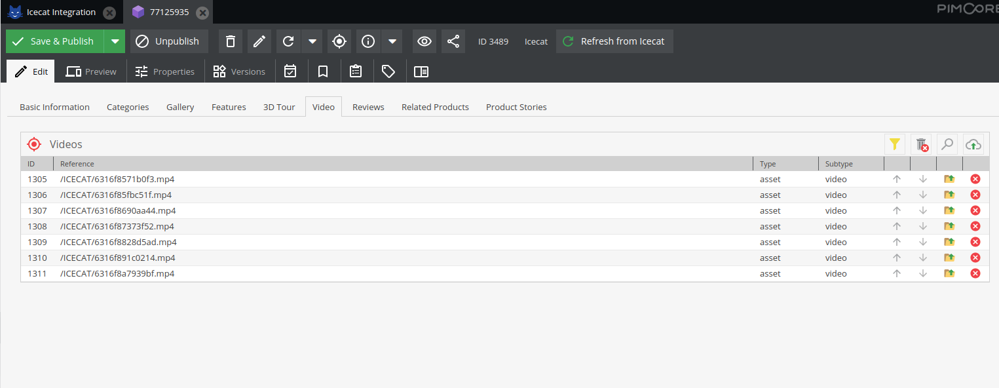
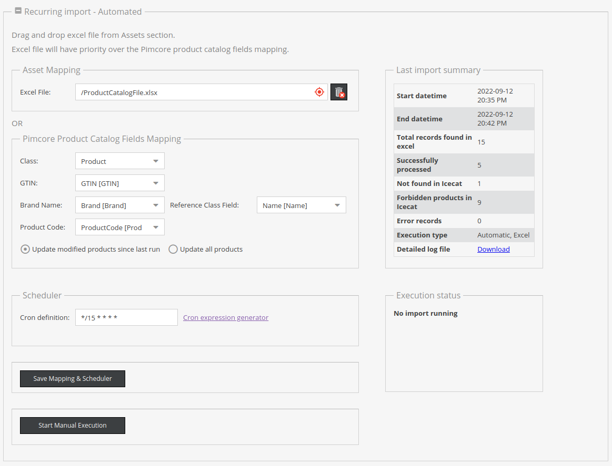
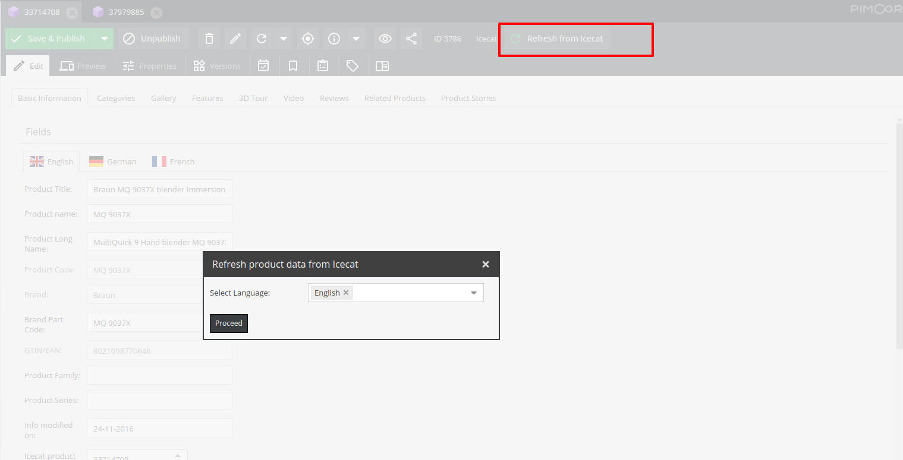

##Icecat plugin v3.0.0

**Install latest version**

~~~~~~~~~~~~~~~~~~~~~
$ composer require icecat/icecat-integration:^3.0
~~~~~~~~~~~~~~~~~~~~~

**Update existing icecat plugin**

~~~~~~~~~~~~~~~~~~~~~
$ composer require icecat/icecat-integration:^3.0
$ bin/console doctrine:migrations:migrate --prefix=IceCatBundle\\Migrations
~~~~~~~~~~~~~~~~~~~~~

## New features listing

**Addition of new fields in import**

<ins>Reviews</ins>

Icecat product's reviews are now part of the import process. 


<ins>Product Stories</ins>

Products stories URL(s) are now imported along with the nice preview.


<ins>Videos</ins>

Video field is changed from type video to many to many relation. This is done to enable the import process to download and attach multiple videos if any product has. 


<ins>Related Products</ins>

Related products are now part of import process with an extra configuration on the Icecat screen. 


By default, import process only checks if the related products already exists in Pimcore and attaches them to product. With this configuration enabled, import will also create the related products on the fly which don't exists.


**Advanced filter options**

Additional filters are added on Icecat filter screen to enable user to search for products more easily and efficiently. 


**Icecat links on login screen**

Helpful links are included on login screen to easily navigate user to Icecat's user registration page, forgot password page and contact us page.


**Overwritable fields**

Provided users the ability to not overwrite product fields while (re)importing products from Icecat.
Whenever user makes any updates to Icecat class objects, change logs gets recorded in Pimcore and when re-importing import process makes sure to not overwrite those fields data.

All the change logs can be seen under "Icecat overwritten fields log" folder.


In order to make those fields overwritable again, just delete the log entries from the folder and data will be reimported.

**Recurring Import**

A new section is added on icecat screen to allow users to set automated recurring import from Icecat.
Multiple options are provided like users can either save any excel file with list of GTINs / Product code and Brand combinations or can set their Product class fields mapping to pick list of products from there which needs to be imported from Icecat.
Users can set the schedule of recurring import job as cron expression or can also do a manual start. Running job can be cancelled at any time. 
A detailed summary of the last executed job shows up when the job finishes.


Its required to set the following command in crontab to make sure the scheduler works properly. 

```bash
*/5 * * * * /your/project/bin/console icecat:recurring-import
```
Keep in mind, that the cron job has to run as the same user as the web interface to avoid permission issues (eg. `www-data`).

**Single product update**

Provided option on the object toolbar to update single product from Icecat.
